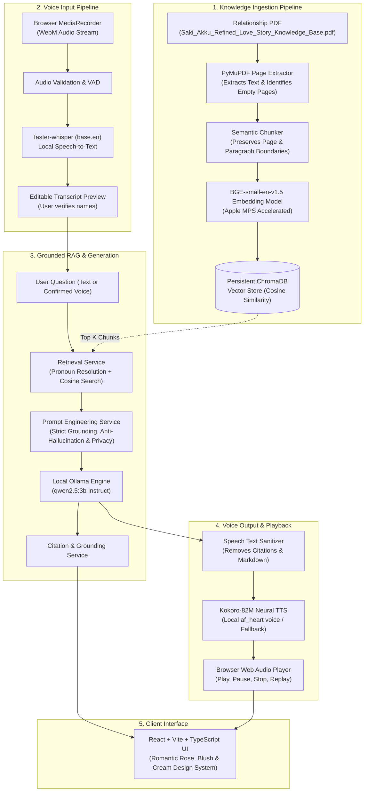

# Saki & Akku — Relationship AI Chatbot & Voice Assistant
### *A Personalized Birthday Gift for Akku (Akshatha) from Saki (Saketh)*

> "Every relationship has little moments that become unforgettable. Ask me about the memories, messages, and moments recorded in Saki and Akku's story."

---

## 1. Project Overview

**Saki & Akku** is a personalized, private, locally runnable AI relationship chatbot and voice assistant. It is grounded in the real relationship documentation: **"Saki & Akku — A Love Journey Told Through Emails"**.

The application allows Akku and Saki to:
- **Chat** about documented memories, college days, presentations, challenges, and future hopes.
- **Voice Assist**: Ask questions using the microphone and receive spoken responses.
- **Transcribe & Edit**: View Whisper's local speech transcription and edit names (e.g., Saki, Akku) before submitting.
- **Hear Spoken Answers**: Powered by **Kokoro-82M** local neural TTS (with Edge-TTS high-quality fallback).
- **Inspect Grounded Citations**: Every factual statement is cited with exact page numbers and excerpts from the source document.
- **100% Privacy & Local Inference**: Runs entirely locally on an **Apple MacBook Air M4 (16 GB Unified Memory)** with no mandatory paid or external cloud LLM APIs.

---

## 2. Architecture & Data Flow



---

## 3. Technology Stack

### Frontend
- **Framework**: React 19, Vite, TypeScript
- **Styling**: Tailwind CSS v3 with customized romantic blush, muted rose, warm cream & champagne palettes
- **Icons**: Lucide React
- **Audio Capture & Playback**: Web Audio API, MediaRecorder API with WebM/Opus format negotiation
- **State Management**: Custom React hooks (`useChat`, `useVoice`, `useConversations`)

### Backend
- **Framework**: Python 3.11, Django 5.2, Django REST Framework, django-cors-headers
- **PDF Extraction**: PyMuPDF (`pymupdf`)
- **Vector Database**: Persistent local ChromaDB with cosine similarity
- **Embedding Model**: `BAAI/bge-small-en-v1.5` via `sentence-transformers` (with Apple Silicon MPS acceleration)
- **LLM Engine**: Ollama running `qwen2.5:3b`
- **Speech Recognition (ASR)**: `faster-whisper`
- **Speech Synthesis (TTS)**: `Kokoro-82M` neural voice engine + `edge-tts` fallback
- **Database**: SQLite (architected with clean service boundaries for PostgreSQL/pgvector migration)

---

## 4. Hardware Optimization & Memory Budget

### Tested on Apple MacBook Air M4 (16 GB Unified Memory)
| Component | Measured Model Size | Runtime Working Memory | Device Acceleration |
| :--- | :--- | :--- | :--- |
| **Qwen 2.5 3B (Q4)** | 1.9 GB | ~2.5 – 3.2 GB | Metal / MLX (Ollama) |
| **Whisper (base.en)** | ~140 MB | ~0.5 GB | Apple CPU / NEON |
| **Kokoro-82M TTS** | ~327 MB | ~0.8 GB | PyTorch MPS |
| **BGE Small Embeddings** | ~133 MB | ~0.4 GB | PyTorch MPS |
| **Django + ChromaDB + React**| — | ~0.6 GB | Unified Memory |
| **Total System Footprint** | — | **~4.8 – 5.5 GB** | **Well within 16 GB** |

The system uses **sequential voice processing** (ASR $\rightarrow$ RAG $\rightarrow$ LLM $\rightarrow$ TTS) so models do not exhaust unified memory or cause thermal throttling on fanless MacBook Air systems.

---

## 5. Strict Factual Grounding & Relationship Rules

The assistant is strictly instructed and evaluated on the following relationship principles:
1. **Never Invent Facts**: Never fabricate a date, quote, location, or promise.
2. **Proposal Record**: May 4, 2022 after mechanical class walking to the canteen over a samosa.
3. **No Marriage Assumption**: The source documents reflect hopes and promises to marry, but do **not** confirm a marriage occurred.
4. **Relationship Duration**: Preserves differing references (e.g., 3 years vs 4 years, 6 months) as recorded in the source.
5. **Harmful Behavior**: Never romanticizes or excuses physical violence (such as the admitted incident where Saki hit Akku); handles sensitive issues with honesty and emotional care.
6. **Unknowns**: If information is absent from the PDF, the assistant responds: *"The documented relationship memories do not mention this."*

---

## 6. Setup & Installation Instructions

### Step 1: Clone or Navigate to Project
```bash
cd /Users/pvsairamsaketh/Documents/akku
```

### Step 2: Ensure Ollama is Running & Pull Model
```bash
# Start Ollama service (Homebrew)
brew services start ollama

# Pull Qwen 2.5 3B model
ollama pull qwen2.5:3b
```

### Step 3: Activate Python 3.11 Virtual Environment
```bash
# Virtual environment is already set up in .venv
source .venv/bin/activate

# Verify dependencies
pip install -r backend/requirements.txt
```

### Step 4: Run Migrations & Ingest PDF Knowledge Base
```bash
# Run database migrations
python backend/manage.py migrate

# Ingest relationship document into ChromaDB (if reindexing is needed)
python -c "
import os, sys, django
os.environ.setdefault('DJANGO_SETTINGS_MODULE', 'config.settings')
sys.path.insert(0, os.path.abspath('backend'))
django.setup()
from documents.services.ingestion_service import IngestionService
IngestionService().ingest_pdf('Saki_Akku_Refined_Love_Story_Knowledge_Base.pdf')
"
```

### Step 5: Start Django Backend Server
```bash
source .venv/bin/activate
python backend/manage.py runserver 8000
```
Backend will be live at `http://localhost:8000`.

### Step 6: Start React Frontend Server
In a separate terminal window:
```bash
cd frontend
npm install
npm run dev
```
Frontend will be live at `http://localhost:5173`.

---

## 7. Running Automated Tests

Run the complete test suite (16 tests across documents, RAG, chat, and voice):
```bash
source .venv/bin/activate
pytest backend/tests
```
All tests run with real components and mocks where appropriate, verifying:
- PDF page extraction and blank appendix detection
- Cosine similarity vector search in ChromaDB
- Prompt grounding & anti-hallucination rules
- Conversation persistence & follow-up resolution
- TTS neural audio generation & Whisper transcription

---

## 8. API Reference

| Method | Endpoint | Description |
| :--- | :--- | :--- |
| `GET` | `/api/health/` | System status, model names, and health check |
| `POST` | `/api/chat/` | Standard RAG question answering |
| `POST` | `/api/chat/stream/` | Server-Sent Events (SSE) streaming response |
| `GET` | `/api/conversations/` | List all saved relationship conversations |
| `POST` | `/api/conversations/` | Create a new conversation thread |
| `GET` | `/api/conversations/<id>/` | Fetch conversation messages with citations |
| `PATCH`| `/api/conversations/<id>/` | Rename conversation title |
| `DELETE`| `/api/conversations/<id>/`| Delete conversation |
| `POST` | `/api/documents/ingest/` | Ingest PDF file into vector index |
| `GET` | `/api/documents/status/` | View indexed document metadata & vector count |
| `POST` | `/api/documents/reindex/`| Full vector store rebuild |
| `POST` | `/api/voice/transcribe/` | Whisper audio file transcription |
| `POST` | `/api/voice/chat/` | End-to-end voice query $\rightarrow$ RAG $\rightarrow$ spoken audio |
| `POST` | `/api/voice/speak/` | Synthesize text to spoken audio (Kokoro-82M) |
| `GET` | `/api/voice/status/` | ASR and TTS model availability |
| `POST` | `/api/retrieval/debug/` | Development inspect raw chunks, scores & distances |

---

## 9. Switching Models & Customization

All parameters are configurable in `backend/.env`:
- **Larger LLM**: Change `OLLAMA_MODEL=qwen2.5:7b` (Ensure ~6.5 GB free RAM).
- **TTS Voice**: Change `TTS_VOICE=af_heart`, `af_bella`, `af_nicole`, `am_adam`.
- **Top K**: Adjust `RAG_TOP_K=5` or `RAG_MIN_RELEVANCE=0.25` for retrieval depth.

---

Made with ❤️ as a personalized birthday gift for Akku & Saki.
