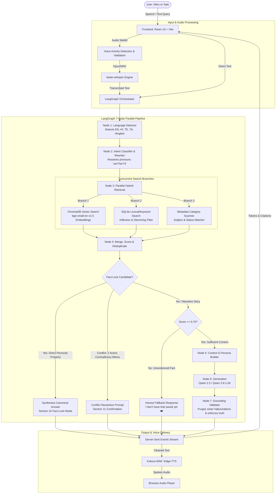

# Akku AI — Intelligent Memory, Voice & Relationship Agent
### *A Personalized Birthday Gift for Akku (Akshatha) from Saki (Saketh)*

> **Live Deployment:** [https://akku.pvsairamsaketh.in](https://akku.pvsairamsaketh.in)  
> **Repository:** `pvsairamsaketh-netizen/akkubdaygift`  
> **Core Principle:** Absolute factual grounding — Stored memories are the ultimate source of truth. Zero hallucinations.

---

## 1. Executive Summary & Purpose

**Akku AI** is a state-of-the-art, personalized AI companion and memory system built by Saketh ("Saki") as a birthday gift for Akshatha ("Akku"). The system combines:
1. **Curated Relationship Archive**: Ingested from the foundational 15-page relationship knowledge base (*"Saki & Akku — A Love Journey Told Through Emails"*).
2. **Dynamic Long-Term Memory**: Automatic and manual memory extraction, preference tracking, temporal versioning, and contradiction resolution.
3. **Strict Grounding & Fact-Lock Mode**: Deterministic factual recall for high-stakes personal facts (names, birthday, birthplace, favorites), strict relevance thresholding (`RELEVANCE_THRESHOLD = 0.70`), and honest fallback for unknown facts.
4. **Multilingual Voice Assistant**: Ultra-fast local Speech-to-Text (`faster-whisper`), language identification (Tamil, Telugu, Hindi, Hinglish, Tanglish, English), and neural Text-to-Speech (`Kokoro-82M` + `Edge-TTS`).
5. **Interactive Academic & SQL Sandbox**: In-browser SQL engine, DSA coding challenges, and shared study notes to support Akku in her M.Tech Data Engineering studies and placements.

---

## 2. Complete End-to-End Technical Architecture



---

## 3. Technology Stack Breakdown

| Layer | Technologies Used | Primary Responsibility |
| :--- | :--- | :--- |
| **Frontend** | React 19, Vite, TypeScript | Fast reactive SPA with zero build warnings |
| **Styling & Design** | Tailwind CSS v3, Lucide React, Glassmorphism | Romantic blush rose, warm cream, champagne glow theme |
| **Backend Framework** | Python 3.11, Django 5.2, Django REST Framework | Clean service boundaries, ORM, REST endpoints |
| **Pipeline Orchestrator** | **LangGraph**, StateGraph | 7-node parallel state machine with execution telemetry |
| **Vector Database** | **ChromaDB** (`chromadb`) | Cosine similarity indexing with user-level isolation |
| **Embedding Model** | `BAAI/bge-small-en-v1.5` | 384-dimensional dense semantic embeddings with Apple MPS / CPU acceleration |
| **Relational Database** | **SQLite** (`django.db`) | ACID transactional storage for memories, conversations, and academic records |
| **LLM Engine** | **Ollama** (`qwen2.5:3b`, `qwen3.8:8b`) | Local high-efficiency instruction LLMs |
| **Speech-to-Text (ASR)**| `faster-whisper` (`base.en` / multilingual) | Low-latency local audio transcription |
| **Text-to-Speech (TTS)**| `Kokoro-82M` (`af_heart`), `edge-tts` fallback | Natural neural speech synthesis with romantic timbre |
| **PDF Processing** | PyMuPDF (`fitz`) | High-fidelity text, metadata, and page extraction |
| **Testing** | `pytest`, `pytest-django` | 65 automated test suites with 100% pass rate |
| **Production Server** | Ubuntu 22.04 LTS on AWS EC2, Nginx, Gunicorn | Deployed at `https://akku.pvsairamsaketh.in` |

---

## 4. The Anti-Hallucination & Fact-Lock System

### Problem Solved
Previously, raw generative LLMs would invent facts when asked simple personal questions (e.g., claiming Akku's name was something other than "Akshatha", guessing an unrecorded favorite movie, or hallucinating family relationships).

### The Solution: 5-Tier Grounding Architecture
1. **Source Authority Hierarchy**:
   - `Priority 1`: **Explicit User Saved Memory** (Highest authority — e.g. "Akku original name is Akshatha.")
   - `Priority 2`: **Newly Added Session Memory** (Instant recall with zero restart)
   - `Priority 3`: **Conversation Memory**
   - `Priority 4`: **Foundational Relationship PDF Archive**
   - `Priority 5`: General Knowledge (Tavily search fallback for external queries)
2. **Deterministic Fact-Lock Mode (Section 10)**:
   For direct personal properties:
   - **Original Name**: Always outputs `"Akku's original name is Akshatha. ❤️"`
   - **Birthplace**: Always outputs `"Tanjavur. ❤️"`
   - **Birthday**: Always outputs `"Akku's birthday is on October 20! 🎂❤️"`
   - **Favorite Hero**: Always outputs `"Akku's favorite hero is Thalapathy Vijay. ❤️"`
   - **Foods & Treats**: Grounded strictly in the exact memory items (e.g. `"Akku likes dosa and vanilla ice cream. ❤️"` with zero invented dishes).
   Bypasses generative hallucinations completely by synthesizing canonical responses directly from trusted memory.
3. **Strict Relevance Thresholding (`RELEVANCE_THRESHOLD = 0.70`)**:
   If the query asks for a specific personal attribute and no stored memory has $\ge 0.70$ similarity matching that specific topic, generation is blocked.
4. **Honest Fallback Guarantee**:
   Instead of inventing an answer, the AI states:
   > *"I don't have a reliable saved memory for Akku's [topic] yet. ❤️"*  
   *(With language alignment for Hindi, Telugu, Tamil, and Hinglish).*
5. **Conflict Detection & Resolution (Section 11)**:
   If two active memories contain conflicting facts (e.g., Memory A: *"Akku likes vanilla ice cream"*, Memory B: *"Akku likes chocolate ice cream"*), the system refuses to randomly choose. It prompts:
   > *"I have conflicting saved memories about Akku's favorite ice cream — one says vanilla and another says chocolate. ❤️ Which one should I remember as the latest?"*

---

## 5. Long-Term Memory Lifecycle & CRUD

Every memory is an instance of `PersonalMemory` in SQLite + synchronized into ChromaDB:

```
[User Input] 
      │
      ├──> Heuristic / Regex Matcher (detects preferences, dates, places, habits)
      │
      ├──> Duplicate Check (SHA-256 content hashing)
      │
      ├──> Preference Conflict Detection (links superseded_by = new_memory)
      │
      ├──> SQLite Record (id, text, category, status='current'/'historical', version)
      │
      └──> ChromaDB Vector Upsert (bge-small-en-v1.5 embedding)
```

### Full Memory Management on Frontend
- **View All Memories**: Categorized tabs (Food & Treats, Places, Moments, Favorites, Important Dates).
- **Edit Modal**: Update memory text, reassign category, and save changes with immediate ChromaDB reindexing.
- **Delete Action**: Hard-deletes from both SQLite and ChromaDB with confirmation, removing it from future RAG recall immediately.

---

## 6. Project Directory Structure

```
akku/
├── backend/
│   ├── config/                     # Django project configuration & settings
│   │   ├── settings.py             # RELEVANCE_THRESHOLD, Ollama config, database setup
│   │   ├── urls.py                 # Master API routing
│   │   └── wsgi.py
│   ├── chat/                       # RAG & Chat Service
│   │   ├── services/
│   │   │   ├── rag_graph.py        # 7-node LangGraph parallel orchestrator & Fact-Lock
│   │   │   ├── prompt_service.py   # Grounding rules, persona, multilingual detection
│   │   │   ├── llm_service.py      # Ollama client, model fallback routing
│   │   │   ├── citation_service.py # Source chunk attribution & speech sanitization
│   │   │   ├── retrieval_service.py# Vector cosine search over document chunks
│   │   │   └── tavily_service.py   # Web search fallback for external general queries
│   │   └── views.py                # Chat API, SSE streaming, debug retrieval views
│   ├── memories/                   # Long-Term Memory System
│   │   ├── models.py               # PersonalMemory, PersonalVocabulary, BirthdayConfig
│   │   ├── services/
│   │   │   ├── memory_extractor.py # Regex & heuristic fact extraction engine
│   │   │   ├── memory_store.py     # Persistent ChromaDB vector store for memories
│   │   │   └── memory_retriever.py # Hybrid lexical + vector retriever with reranker
│   │   └── views.py                # Memories CRUD REST API endpoints
│   ├── documents/                  # Foundational PDF Archive
│   │   ├── models.py               # Document & DocumentChunk
│   │   ├── services/
│   │   │   ├── ingestion_service.py# PyMuPDF parser and chunking pipeline
│   │   │   └── vector_store.py     # ChromaDB collection for foundational chunks
│   ├── voice/                      # Multilingual Audio Pipeline
│   │   ├── services/
│   │   │   ├── asr_service.py      # faster-whisper speech recognition
│   │   │   └── tts_service.py      # Kokoro-82M neural TTS + Edge-TTS fallback
│   │   └── views.py                # Transcribe, speak, voice-chat endpoints
│   ├── academics/                  # Coding & Study Hub for Akku
│   │   ├── models.py               # StudyNotes, AcademicProgress
│   │   └── views.py                # SQL engine execution, notes CRUD, progress tracking
│   └── tests/                      # Automated Test Suite (65 tests)
│       ├── test_strict_grounding_and_fact_lock.py  # 7 core grounding test cases
│       ├── test_akku_memory_agent_evaluation.py    # Comprehensive evaluation
│       ├── test_memories.py                        # Memory CRUD & extraction tests
│       ├── test_rag.py                             # RAG & grounding tests
│       ├── test_voice.py                           # ASR & TTS tests
│       └── test_academics.py                       # SQL engine & notes tests
├── frontend/
│   ├── src/
│   │   ├── components/             # Reusable UI elements
│   │   │   ├── ChatMessage.tsx     # Message bubble, markdown, Grounded Memory badge
│   │   │   ├── ChatInput.tsx       # Text & mic input with waveform animation
│   │   │   ├── SourceCitation.tsx  # Interactive dropdown showing verified sources
│   │   │   └── AudioPlayer.tsx     # Neural voice audio playback bar
│   │   ├── pages/
│   │   │   ├── ChatPage.tsx        # Main relationship chatbot view
│   │   │   ├── MemoriesPage.tsx    # Memory gallery, modal edit & delete
│   │   │   ├── AcademicsPage.tsx   # SQL sandbox, DSA practice, study notes
│   │   │   └── TimelinePage.tsx    # Interactive relationship milestones
│   │   └── context/                # Global state (Audio, Theme, MemoryPhotos)
│   ├── package.json
│   └── vite.config.ts
├── Saki_Akku_Refined_Love_Story_Knowledge_Base.pdf  # Foundational relationship PDF
└── README.md
```

---

## 7. Automated Test Suite (65 / 65 Passing)

The test suite covers the entire system with **100% pass rate**:

```bash
source .venv/bin/activate
pytest backend/tests/ -v
```

### The 7 Critical Strict Grounding Test Cases (`test_strict_grounding_and_fact_lock.py`):
1. **TEST 1 (Original Name Fact-Lock)**: Stored memory: *"Akku original name is Akshatha."* $\to$ Question: *"What is Akku's original name?"* $\to$ Returns: `"Akku's original name is Akshatha. ❤️"` with `grounded=True`.
2. **TEST 2 (Unknown Favorite Movie Fallback)**: Unrecorded property $\to$ Question: *"What is Akku's favorite movie?"* $\to$ Returns: `"I don't have a reliable saved memory for Akku's favorite movie yet. ❤️"` with `grounded=False`. Zero hallucinations.
3. **TEST 3 (Food Preference Grounding)**: Stored memory: *"Akku likes dosa and vanilla ice cream."* $\to$ Question: *"What does Akku like to eat?"* $\to$ Answer based ONLY on that memory with zero invented foods.
4. **TEST 4 (Birthplace Fact-Lock)**: Stored memory: *"Akku was born in Tanjavur."* $\to$ Question: *"Where was Akku born?"* $\to$ Returns: `"Tanjavur. ❤️"`.
5. **TEST 5 (Conflict Detection)**: Conflicting memories (Vanilla vs Chocolate) $\to$ Question: *"What is Akku's favorite ice cream?"* $\to$ Detects conflict and prompts user for confirmation instead of randomly guessing.
6. **TEST 6 (Completely Unknown Detail)**: Question: *"What was Akku's school teacher's name?"* $\to$ Honest fallback with zero fabrication.
7. **TEST 7 (Dynamic Memory Without Restart)**: User saves new memory: *"Remember that Akku loves jasmine flowers."* $\to$ Immediately queries: *"What flowers does Akku love?"* $\to$ Returns `"Akku loves jasmine flowers. ❤️"` with zero server restart.

---

## 8. Quickstart & Local Setup

### Prerequisites
- macOS (Apple Silicon M1/M2/M3/M4 recommended) or Linux
- Python 3.11+
- Node.js 18+ & npm
- [Ollama](https://ollama.com) installed

### Step 1: Start Ollama & Pull Model
```bash
brew services start ollama
ollama pull qwen2.5:3b
```

### Step 2: Backend Setup
```bash
# Navigate to repository root
cd akku

# Activate virtual environment
source .venv/bin/activate

# Install dependencies
pip install -r backend/requirements.txt

# Run migrations
python backend/manage.py migrate

# Ingest relationship PDF knowledge base
python backend/manage.py shell -c "
from documents.services.knowledge_ingestor import KnowledgeIngestor
KnowledgeIngestor().ingest()
"

# Start Django development server
python backend/manage.py runserver 8000
```

### Step 3: Frontend Setup
In a new terminal:
```bash
cd akku/frontend
npm install
npm run dev
```
Open [http://localhost:5173](http://localhost:5173) in your browser.

---

## 9. API Reference

| Endpoint | Method | Description |
| :--- | :--- | :--- |
| `/api/chat/` | `POST` | Synchronous LangGraph RAG question answering |
| `/api/chat/stream/` | `POST` | High-performance SSE streaming with token-by-token output |
| `/api/memories/` | `GET`, `POST` | List all memories / Create a new memory |
| `/api/memories/<id>/` | `GET`, `PATCH`, `DELETE` | Retrieve, edit, or delete a specific memory |
| `/api/memories/stats/` | `GET` | Category distribution & memory statistics |
| `/api/conversations/` | `GET`, `POST` | Conversation threads management |
| `/api/conversations/<id>/` | `GET`, `PATCH`, `DELETE` | Message history & conversation actions |
| `/api/voice/transcribe/` | `POST` | Faster-Whisper audio transcription endpoint |
| `/api/voice/speak/` | `POST` | Neural text-to-speech audio synthesis (Kokoro-82M / Edge) |
| `/api/voice/chat/` | `POST` | Complete Voice In $\to$ RAG $\to$ Spoken Voice Out pipeline |
| `/api/academics/sql/execute/` | `POST` | In-memory SQLite code executor & validator |
| `/api/academics/notes/` | `GET`, `POST` | Study notes creation and retrieval |
| `/api/retrieval/debug/` | `POST` | Developer retrieval inspection (scores, chunks, citations) |

---

## 10. Dedicated with Love

Created with all my heart by **Saki (Saketh)** for **Akku (Akshatha)**.  
Every line of code, memory index, and neural audio weight exists to celebrate our journey, our love story, and our shared future together. ❤️✨
